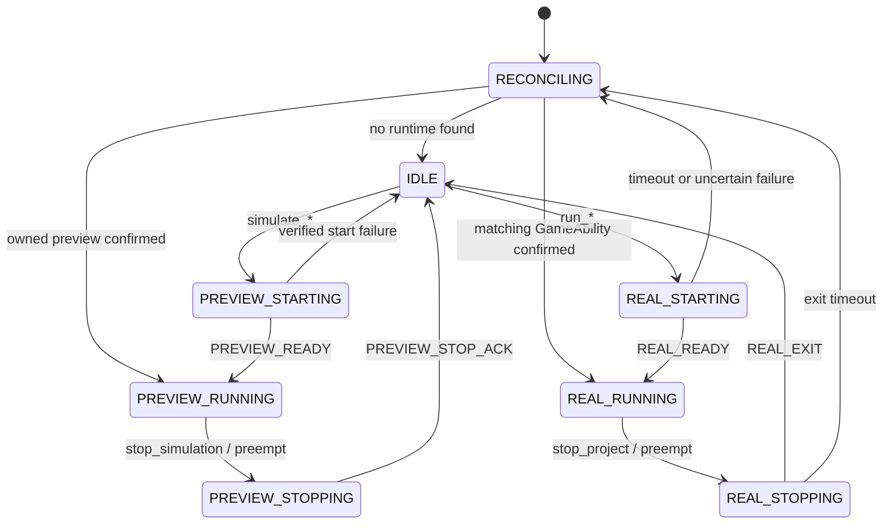

## Context

See `proposal.md` for motivation. The OpenHarmony editor and game run in
different Ability processes:

- `EditorAbility` owns the Godot editor, MCP server, toolbar, and preview UI.
- `GameAbility` owns the standalone game window, real SceneTree, real input and
  audio pipelines, and authoritative runtime behavior.

The current router bypasses the real run handlers for several public commands.
The preview runner executes inside the editor SceneTree, so it cannot safely
emulate standalone process, Autoload, SceneTree replacement, or OS lifecycle
semantics. Ability startup and shutdown are asynchronous, while current state is
represented by an uncorrelated global Boolean.

The canonical OpenSpec root for this change is the version-controlled
`godot_zw/openspec` directory. The older workspace-level copy is not an
implementation source of truth.

## Goals / Non-Goals

**Goals:**

- Make command names, modes, sources, and stop targets unambiguous.
- Serialize lifecycle operations and correlate every cross-process event with a
  session and operation.
- Confirm real-run readiness and exit instead of inferring them from a deferred
  editor call or foreground transition.
- Produce screenshot evidence from the requested backend without modifying the
  project or silently substituting another source.
- Keep preview useful for static scene composition while preventing execution of
  a second copy of project gameplay scripts inside the editor.
- Preserve compatibility through explicit aliases and deprecation metadata.

**Non-Goals:**

- Runtime-equivalent gameplay, physics, audio, Autoload, networking, file, OS,
  input, or multi-scene behavior inside preview.
- A general process supervisor for arbitrary HarmonyOS applications.
- A guarantee that an opaque preview overlay suspends the editor renderer or
  releases all GPU resources.
- Passing Stage 4 QA from preview screenshots alone.

## Decisions

### Decision 1: Canonical commands and compatibility aliases

Canonical commands are:

| Command | Target | Meaning |
|---|---|---|
| `run_project` | real | Start the configured main scene in `GameAbility` |
| `run_scene` | real | Start the scene identified by `path` |
| `run_current_scene` | real | Start the current editor scene |
| `stop_project` | real | Stop only the active real-run session |
| `simulate_project` | preview | Preview the configured main scene |
| `simulate_scene` | preview | Preview the scene identified by `path` |
| `simulate_current_scene` | preview | Preview the current editor scene |
| `stop_simulation` | preview | Stop only the active preview session |
| `get_execution_state` | read-only | Return the authoritative lifecycle snapshot |
| `take_screenshot` | read-only/capture | Capture exactly `editor`, `preview`, or `game` |

`run_scene` and `simulate_scene` use `path` as the canonical parameter and accept
`scene_path` and `scene` as deprecated input aliases.

Compatibility mapping is fixed:

| Alias | Canonical target | Policy |
|---|---|---|
| `run_main_scene` | `run_project` | Stable alias |
| `stop_playing_scene` | `stop_project` | Stable alias |
| `play_main_scene` | `run_project` | Deprecated real-run alias |
| `play_scene` | `run_scene` | Deprecated real-run alias |
| `play_current_scene` | `run_current_scene` | Deprecated real-run alias |
| `stop_scene` | `stop_project` | Deprecated real-run alias |
| `is_simulation_running` | `get_execution_state` | Deprecated derived response |
| `get_game_screenshot`, `capture_game_screenshot` | `take_screenshot(source="game")` | Deprecated alias |
| `get_editor_screenshot`, `capture_screenshot`, `get_screenshot` | `take_screenshot(source="editor")` | Deprecated alias |

Every deprecated alias returns `deprecated_alias: true` and `replacement`.
No alias means “stop whichever mode is active.”

All start commands accept:

- `conflict_policy`: `reject` (default) or `preempt`.
- `preempt`: deprecated Boolean alias for `conflict_policy`.
- `save_policy`: `require_clean` (default) or `save`.
- `operation_id`: optional client retry key.

The default conflict policy is deliberately non-destructive. Automation may
request `preempt`, but the coordinator must complete and acknowledge the source
stop before it starts the target.

### Decision 2: One asynchronous lifecycle coordinator

A single `LifecycleCoordinator` is the only authority that changes lifecycle
state. MCP routing, toolbar and HUD controls, Godot editor play/stop callbacks,
and Ability events submit commands or events to it. They do not call the preview
runner, editor play API, or state-reset functions directly.

The state set is:

- Stable: `IDLE`, `PREVIEW_RUNNING`, `REAL_RUNNING`.
- Transitional: `PREVIEW_STARTING`, `PREVIEW_STOPPING`, `REAL_STARTING`,
  `REAL_STOPPING`, `RECONCILING`.

Failure is an operation/session outcome, not a permanent execution state. The
coordinator settles into a verified stable state or `RECONCILING`. New start
commands are rejected during reconciliation.



`REAL_STOP_ACK` confirms only that `GameAbility` accepted a stop. It does not
mean the process exited and does not transition to `IDLE`. Preview stop completes
only after the preview scene, input proxy, overlay, focus ownership, and runner
hooks are actually removed; calling `queue_free()` alone is not an ACK.

### Decision 3: Session, operation, event, and idempotency model

The coordinator generates an immutable UUID-based `session_id` for each accepted
start (`real_<uuid>` or `sim_<uuid>`). A timestamp may be logged but is not the
uniqueness source. Each mutating request has a separate `operation_id`; clients
may supply it for retry deduplication.

All state-changing commands and bridge events pass through one serialized
executor. Only one mutating operation is in flight. The coordinator keeps a
bounded cache of active and recently completed operation and event IDs.

- Repeating the same `operation_id` with identical normalized arguments returns
  the existing result.
- Reusing it with different arguments returns `INVALID_OPERATION_ID`.
- Equivalent same-track starts return `already_running` with the existing
  session.
- Repeated stops return the existing stop operation.
- Wrong-track stops return `STATE_CONFLICT` and do not affect the active track.
- Stale or duplicate events are logged and ignored.

Cross-process events use this logical envelope:

```json
{
  "event": "REAL_READY",
  "event_id": "evt_<uuid>",
  "session_id": "real_<uuid>",
  "operation_id": "op_<uuid>",
  "boot_nonce": "<128-bit-random-value>",
  "cause": "requested_start",
  "timestamp": "<RFC3339>",
  "details": {}
}
```

Required events are `PREVIEW_READY`, `PREVIEW_STOP_ACK`, `REAL_READY`,
`REAL_STOP_ACK`, `REAL_EXIT`, and explicit start/stop failure events. `REAL_EXIT`
records `requested_stop`, `user_close`, `engine_exit`, `crash`, or `system_kill`
when known. `startAbilityForResult`, WindowStage destruction, and explicit exit
notifications may report the same exit; the first matching terminal event wins.

Stopping during STARTING sets `cancel_requested`. A late READY for that session
cannot restore RUNNING; the coordinator continues the stop sequence. During a
preemption, `pending_session_id` reserves the target while the source session is
stopping. The lifecycle lock remains held across the internal `IDLE` transition.

### Decision 4: Real-run readiness, exit, and reconciliation

The 15-second timer is deleted because it only clears editor tracking; it does
not prove that `GameAbility` exited. A healthy session has no duration limit.

Before launch, the coordinator creates `{session_id, operation_id, boot_nonce,
project_fingerprint}` in a one-shot in-memory native run-metadata bridge. The
OpenHarmony launch bridge consumes it once and places it in the `GameAbility`
Want. It must not be written to `ProjectSettings`, `EditorSettings`, project
files, or unknown Godot command-line arguments.

`GameAbility` emits `REAL_READY` only after the matching Want is accepted, its
WindowStage and Godot surface exist, and the requested game has produced a first
frame. The response reports capture capabilities separately. A deferred
`EditorInterface.play_*` call or the unresolved `startAbilityForResult` Promise
does not establish readiness.

Explicit stop sends the expected `session_id` and `boot_nonce`. `GameAbility`
returns `REAL_STOP_ACK`, terminates, and emits/correlates `REAL_EXIT`. Startup and
stop handshake timeouts are configurable and apply only to the transition. They
never kill or clear a confirmed healthy RUNNING session.

`EditorAbility.onForeground` triggers reconciliation instead of directly
resetting state. On startup, restart, timeout, or conflicting evidence, the
coordinator enters `RECONCILING`, checks preview ownership and matching
`GameAbility` liveness, and only then reconstructs a stable state.

Failure policy is deterministic:

- Verified preview start failure cleans partial nodes and returns to `IDLE`.
- Uncertain real start or stop failure enters `RECONCILING`.
- A confirmed stop rejection while the runtime remains alive restores RUNNING.
- A preemption never starts its target if the source stop is unconfirmed.
- If the source stopped but the target failed to start, the result is verified
  `IDLE`; the source is not silently restarted.

### Decision 5: Script-free visual preview

Preview is built from `PackedScene.get_state()`/`SceneState` as a visual clone of
serialized native nodes and resources. The clone omits project script
attachments and does not instantiate project Autoloads. Scripted custom types
that cannot be represented safely use an appropriate native placeholder and
produce a structured warning.

The implementation removes `_upgrade_to_tool_scripts`, the global
`SceneTree.node_added` rewrite hook, and preview Autoload emulation. It never
edits script source, attaches generated `@tool` scripts, or executes a second
copy of project gameplay logic in the editor process. Built-in resources,
materials, shaders, animation resources that do not require project scripts, and
audited plugin-owned preview adapters may render.

The preview response contains:

```json
{
  "mode": "preview",
  "capabilities": {
    "static_visual": true,
    "gameplay_scripts": false,
    "autoloads": false,
    "scene_switching": false,
    "authoritative_input": false
  },
  "warnings": []
}
```

The independent backdrop and `SubViewport.own_world_3d` provide visual occlusion
and world isolation. They do not claim background render suspension. Preview
does not write the edited root's `visible`, `process_mode`, owner, transforms, or
dirty state.

### Decision 6: Run-scoped GameAbility screenshot capture

Real screenshots do not use a project Autoload. `GameAbility` starts a lightweight
`GameAbilityCaptureAgent` when the launch Want contains valid MCP run metadata.
The preferred backend reuses ArkUI `componentSnapshot` and PNG encoding against
the `godot_surface` XComponent. The agent is not started for ordinary exported
game launches.

Some HarmonyOS graphics paths may not composite an XComponent surface into
`componentSnapshot`. Device acceptance therefore uses a GameAbility-only random
watermark and increasing frame counter. If the preferred backend produces a
black, stale, or non-advancing frame, the same capture agent uses a native Godot
root-Viewport/RenderingServer hook. This is a same-source backend selection, not
a fallback to editor or preview. The response reports either
`openharmony_game_ability_surface` or `openharmony_game_native_viewport`.

The initial transport is per-session file IPC in the app-private shared
`filesDir`:

```text
<filesDir>/godot_mcp/runtime/<session_id>/
  manifest.json
  ready.json
  requests/<request_id>.json
  acks/<request_id>.json
  frames/<request_id>.png
  responses/<request_id>.json
```

The first implementation task verifies that `EditorAbility` and `GameAbility`
see the same app-private directory. If the platform does not share it, the same
envelope is transported over an authenticated loopback registration with the
EditorAbility gateway; request and response semantics remain unchanged.

Each request carries protocol version, `session_id`, `boot_nonce`, `request_id`,
`source: "game"`, format, creation time, and deadline. Each response carries the
same correlation fields, `backend`, dimensions, byte count, SHA-256, frame
sequence, capture timestamp, and provenance. Writers commit files using a
same-directory temporary file followed by atomic rename. The PNG is committed
before its response JSON; the response is the frame commit marker.

The game capture queue is bounded and serialized at the snapshot operation.
Multiple callers may wait concurrently because every request has a unique path.
The editor validates identifiers, nonce, relative-path containment, timestamp,
PNG signature, size, dimensions, and SHA-256. A late result cannot satisfy a new
request or session. Session shutdown rejects new requests, resolves or cancels
in-flight requests, and cleans only the exact session directory.

### Decision 7: Strict source and response semantics

`take_screenshot.source` is an enum and is never reinterpreted from current
state:

| Requested source | Required state | Actual source | Allowed backend |
|---|---|---|---|
| `editor` | editor available | `editor_viewport` | `godot_editor_ui` |
| `preview` | `PREVIEW_RUNNING` | `preview_subviewport` | `in_editor_subviewport` |
| `game` | `REAL_RUNNING` and capture ready | `game_ability` | one of the two GameAbility backends |

Successful responses include `requested_source`, `actual_source`, `backend`,
`session_id`, `request_id`, artifact metadata, and provenance. Preview and game
responses require a non-empty session ID. A caller-supplied output path is
validated and copied by the editor only after capture verification; the capture
agent never writes to an arbitrary path or `res://`.

Required errors include `RUN_STATE_CONFLICT`, `GAME_NOT_READY`, `CAPTURE_BUSY`,
`CAPTURE_ACK_TIMEOUT`, `CAPTURE_TIMEOUT`, `CAPTURE_BACKEND_UNAVAILABLE`,
`STALE_CAPTURE_RESPONSE`, `CAPTURE_INTEGRITY_ERROR`, and `SESSION_ENDED`. Error
data includes source, expected backend, session, request, stage, and retryability.
No game or preview failure returns an editor image.

Lifecycle success statuses are `accepted`, `already_running`,
`already_stopped`, and `completed`. A start command returns `accepted` with a
STARTING state; it does not claim `running` before READY. Lifecycle failures use
stable codes including `STATE_CONFLICT`, `SESSION_MISMATCH`,
`OPERATION_IN_PROGRESS`, `START_FAILED`, `START_TIMEOUT`, `STOP_FAILED`,
`STOP_TIMEOUT`, and `STATE_UNKNOWN`.

`get_execution_state` always returns the current state, phase, mode, desired
mode, session and pending-session IDs, operation ID, target scene, cancellation
flag, transition timestamp, unresolved error, capabilities, and last session
outcome.

### Decision 8: Clean preflight and source-file immutability

Canonical start commands no longer save implicitly. With the default
`save_policy: "require_clean"`, an unsaved edited scene returns
`UNSAVED_CHANGES` without starting. With `save_policy: "save"`, the command
performs an explicit preflight save, reports `preflight_saved: true`, and creates
the session and hash baseline only after the save succeeds.

Preview and real-run start/stop/capture code must not modify `project.godot` or
`.tscn` files after that baseline. MCP run instrumentation must not call
`ProjectSettings.set_setting()` for temporary Autoloads. Runtime data belongs in
app-private session storage, not `res://`. `.godot` caches and app-private runtime
artifacts are outside the source-file hash invariant.

Acceptance records SHA-256 for `project.godot` and all `.tscn` files after clean
preflight, executes one track at a time, and compares the same file set after
stop. Preview acceptance additionally compares the edited root's relevant
properties and dirty flag.

## Risks / Trade-offs

- **Script-free preview omits script-driven visuals** → Return capability flags
  and per-node warnings; use real run for authoritative evidence.
- **SceneState cloning requires custom-resource handling** → Preserve serialized
  native properties, use explicit placeholders, and test representative 2D/3D/UI
  scenes before removing the legacy path.
- **ArkUI XComponent snapshots may be black or stale** → Verify watermark and
  frame progression on device; select the real GameAbility native-viewport
  backend when necessary and report it explicitly.
- **File IPC may not be shared identically on every HarmonyOS build** → Gate the
  implementation with a two-process visibility test and use the predefined
  loopback transport if the test fails.
- **Default conflict rejection changes automation behavior** → Accept an
  explicit `conflict_policy: "preempt"` and return actionable conflict metadata.
- **Legacy aliases previously meant preview in this fork** → Return deprecation
  metadata and update all bundled skills and method documentation in the same
  release.

## Migration Plan

1. Establish this version-controlled change as the canonical contract and
   reconcile its screenshot rules with `improve-godot-mcp-runtime-qa`.
2. Add contract tests for command mapping, response schemas, errors, and state
   transitions before changing the router.
3. Implement the coordinator and bridge event envelope, then route every entry
   point through it.
4. Replace the preview runner with the non-mutating script-free clone.
5. Implement and device-validate the GameAbility capture agent and correlated
   protocol before removing temporary Autoload injection.
6. Update packaged assets, protocols, skills, and compatibility documentation.
7. Run automated tests, build and deploy the HAP, collect device evidence, and
   present Approval Gate 2. Archive only after that approval.

Rollback is performed by reverting the implementation commit set while keeping
this change unarchived. Do not restore the 15-second reset or silent screenshot
fallback as a rollback shortcut.
