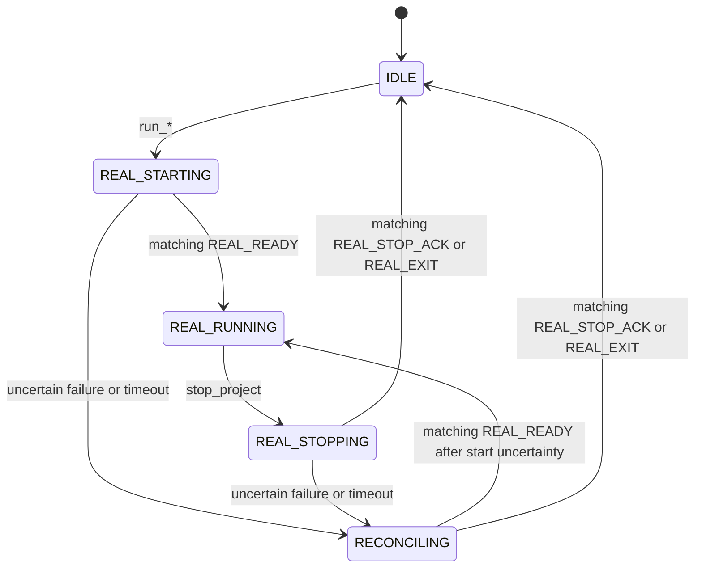

## Context

`EditorAbility` owns the editor and MCP server. `GameAbility` owns the standalone Godot game process, its SceneTree, input, physics, audio, and rendered frames. The deleted simulation runner attempted to create a second game-like SceneTree inside the editor process, but could not execute ordinary game scripts without unsafe mutation and could not provide runtime parity when scripts were disabled.

The canonical OpenSpec root is `godot_zw/openspec`. This document supersedes every preview or dual-track decision previously stored under this change ID.

## Goals / Non-Goals

**Goals:**

- Expose one unambiguous gameplay execution track: standalone `GameAbility`.
- Make lifecycle state depend on correlated runtime evidence, not editor UI state.
- Capture exactly the requested source and reject unavailable capabilities honestly.
- Keep project and scene files byte-for-byte unchanged by runtime instrumentation.
- Preserve reproducible tests and device evidence for every completed acceptance item.

**Non-Goals:**

- Emulating gameplay inside the Godot editor SceneTree.
- Treating an editor or OS screenshot as a game screenshot.
- Adding embedded/windowed presentation; that is specified by the separate windowed-runtime change.
- Claiming runtime inspection, input injection, or native capture when no GameAbility-side agent or bridge exists.

## Decisions

### Decision 1: Single authoritative command surface

Canonical lifecycle commands are:

| Command | Meaning |
|---|---|
| `run_project` | Start the configured main scene in `GameAbility` |
| `run_scene(path=...)` | Start one scene in `GameAbility` |
| `run_current_scene` | Start the current editor scene in `GameAbility` |
| `stop_project` | Stop the active correlated `GameAbility` session |
| `get_execution_state` | Return the authoritative real-run lifecycle snapshot |

`run_main_scene`, `stop_playing_scene`, and existing `play_*` names may remain documented compatibility aliases only when they route to the same real-run handlers. No command or alias may instantiate an editor simulation. `simulate_project`, `simulate_scene`, `simulate_current_scene`, `stop_simulation`, and `is_simulation_running` are unsupported and absent from method discovery.

`take_screenshot.source` is exactly `editor | game`. `preview` is rejected with `INVALID_ARGUMENT`; it is never reinterpreted.

### Decision 2: Real-only lifecycle coordinator

The coordinator state set is:

- `IDLE`
- `REAL_STARTING`
- `REAL_RUNNING`
- `REAL_STOPPING`
- `RECONCILING`

Only the coordinator writes lifecycle state. `EditorInterface.is_playing_scene()` and toolbar callbacks are not readiness evidence. A start remains `REAL_STARTING` until a matching `REAL_READY`. An explicit stop remains `REAL_STOPPING` until the target GameAbility returns the fully correlated `REAL_STOP_ACK` immediately before invoking its OS termination API; spontaneous exits resolve through a matching `REAL_EXIT`.



A confirmed healthy `REAL_RUNNING` session has no duration limit. Transition timeouts only resolve uncertainty through reconciliation; they do not kill the process or falsely set `IDLE`.

### Decision 3: Strict event correlation

Each accepted start generates an immutable 128-bit random `session_id` and `boot_nonce`. A caller-supplied `operation_id` is validated and retained for idempotency; otherwise the coordinator generates a 128-bit random operation ID. Launch metadata reaches `GameAbility` without project settings or unrecognized game arguments. On OpenHarmony, the editor may place the three values in namespaced, editor-process environment slots immediately before the mutually exclusive launch call; native `create_instance` must consume and unset all three on every success and failure path before forwarding them as private Ability launch metadata. The values are not persisted, exposed as project configuration, or inherited as a long-lived game environment. State-changing events use this envelope:

```json
{
  "type": "REAL_READY",
  "event_id": "ohos_game_<timestamp>_<random>",
  "session_id": "real_<128-bit-random-hex>",
  "operation_id": "op_<128-bit-random-hex>",
  "boot_nonce": "<random>",
  "timestamp_ms": 1787814000000,
  "details": {}
}
```

Events with an empty, stale, duplicate, or mismatched identifier are logged and ignored. `GameAbility` emits `REAL_READY` only after its matching launch metadata is accepted, the Godot surface exists, and the requested run has produced a first frame. Explicit stop carries the expected session, operation, and nonce and resolves through its correlated `REAL_STOP_ACK`; the GameAbility emits that acknowledgement only after accepting the request and immediately before calling the OS termination API. `REAL_EXIT` remains authoritative for spontaneous, user-driven, and abrupt lifecycle completion. This explicit event channel is required because `startAbilityForResult` completion is not reliable across isolated Ability processes on every supported device class.

### Decision 4: Project-independent runtime services

The editor plugin must not call `ProjectSettings.add_autoload_singleton()`, remove a project Autoload, or call `ProjectSettings.save()` to inject MCP services. It must not attach service nodes to the edited scene tree as a runtime substitute. A narrowly scoped migration exception removes only the three exact Autoload entries persisted by older MCP versions and saves that cleanup once; compatibility scripts let the first affected editor start reach the migration without missing-file errors.

Game capture uses a run-scoped GameAbility root-viewport agent injected into in-memory `ProjectSettings` by the OpenHarmony bridge after project setup and before Autoload instantiation. The bridge never saves that setting. Inspection and input requests require their own correlated agents; until those exist they return a stable `CAPABILITY_UNAVAILABLE` or `GAME_NOT_READY` error. No runtime command falls back to `edited_scene_root`, the editor viewport, or the OS screen.

Transport artifacts, if file-backed, live under an app-private, exact-session directory and use unique request IDs, atomic commit ordering, path containment, deadlines, and exact-session cleanup. Project files under `res://` are never transport storage.

### Decision 5: Strict screenshot semantics

| Requested source | Required context | Actual source | Allowed backend |
|---|---|---|---|
| `editor` | editor viewport available | `editor_viewport` | `godot_editor_ui` |
| `game` | matching `REAL_RUNNING` session and capture agent ready | `game_ability` | declared GameAbility-only backend |

A successful game response contains non-empty `session_id`, `request_id`, `requested_source`, `actual_source`, `backend`, capture timestamp, dimensions, byte count, format, SHA-256, and provenance. The editor independently validates the committed bytes and all correlation fields before returning success. Missing fields, stale responses, corrupt PNGs, hash mismatches, timeouts, and concurrent request confusion are errors.

`DisplayServer.screen_get_image()` is not a GameAbility capture backend because it can capture the editor or another foreground surface. It is prohibited for `source="game"`.

### Decision 6: Evidence and completion truth

OpenSpec task checkboxes describe verified repository state, not intended work. A task is complete only when its implementation exists and a relevant automated or device check is retained. Device reports must identify the exact build, device, command transcript, lifecycle assertions, artifact hashes, and final state. A screenshot alone cannot prove lifecycle, correlation, or file immutability.

The packaged rawfile add-on must match the source add-on after implementation. Active documentation must not advertise simulation, preview capture, dual-track lifecycle, or unsupported runtime-service behavior.
