# workspace-session-skill 流程图

## 整体架构流程图

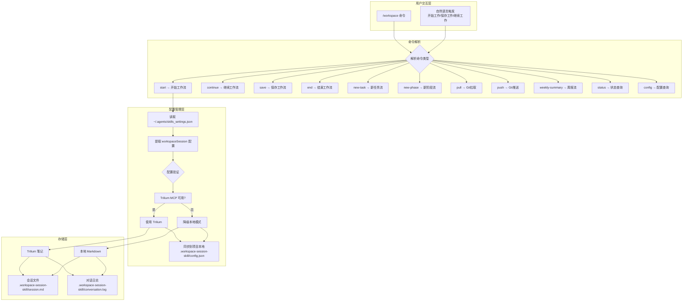

## 开始工作流程图

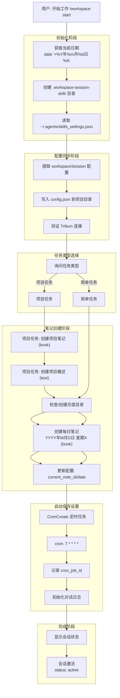

## 继续工作流程图

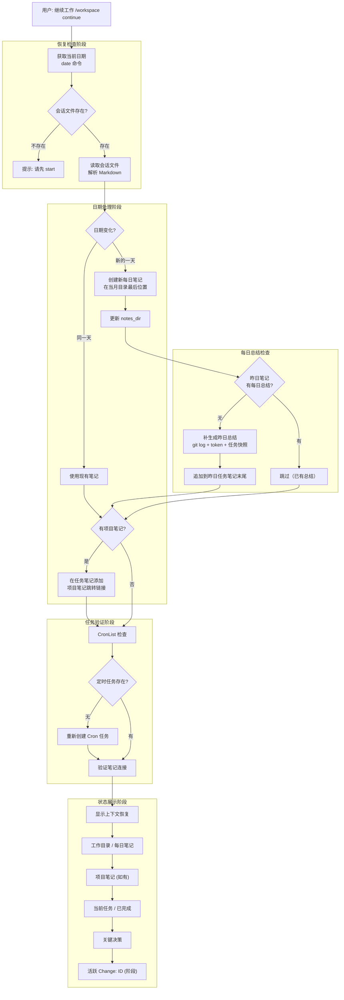

## 保存工作流程图

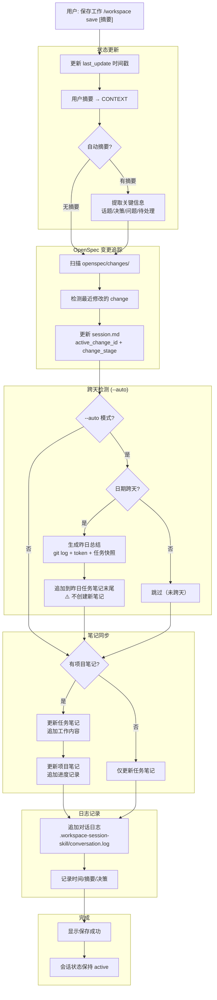

## 结束工作流程图

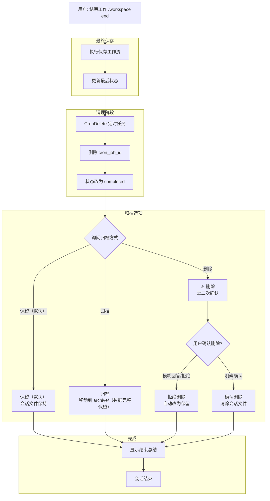

## 项目笔记流程图

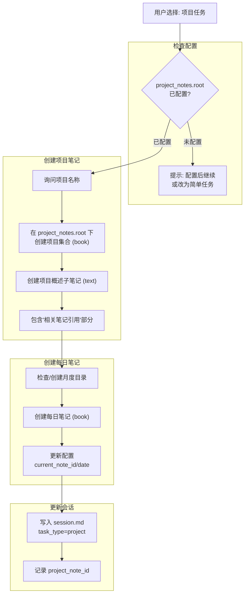

## 新任务流程图

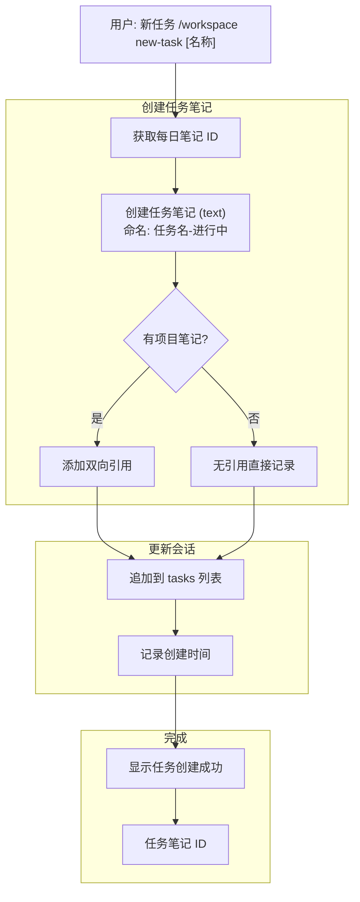

## 周报总结流程图

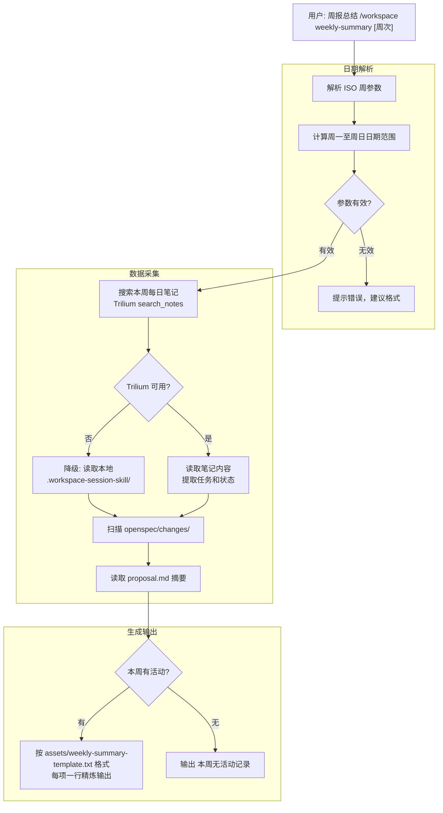

## Trilium 笔记层级结构图

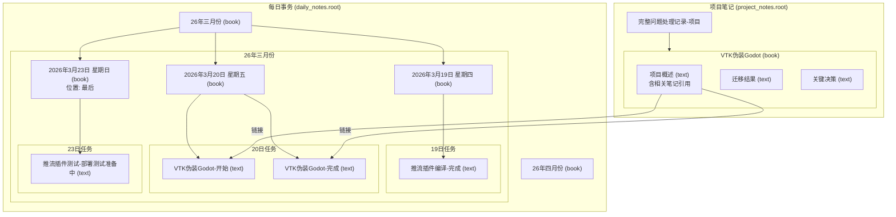

## 双向引用机制图

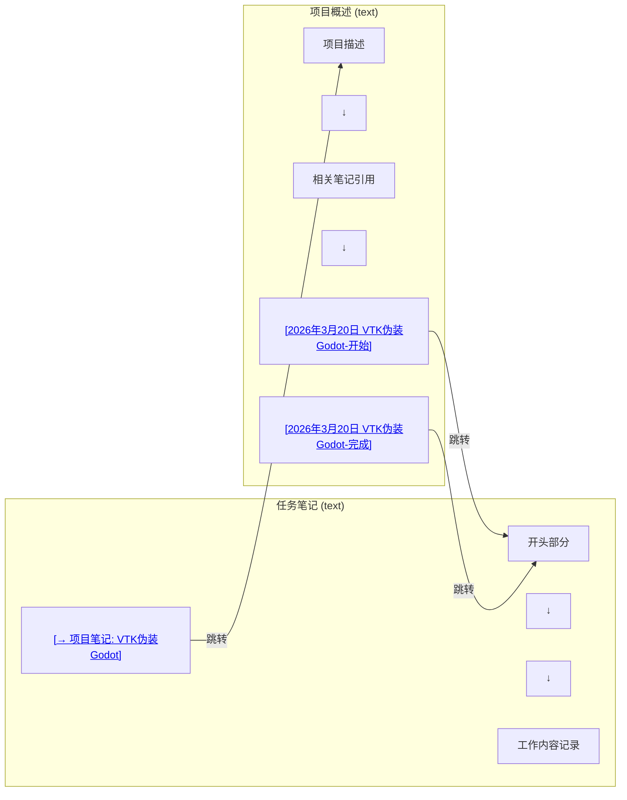

## 数据流向图

```mermaid
flowchart TB
    subgraph 输入["用户输入"]
        I1["命令/自然语言"]
    end

    subgraph 处理["技能处理"]
        P1["命令解析"]
        P2["配置读取"]
        P3["状态管理"]
        P4["笔记操作"]
    end

    subgraph 本地存储["本地存储"]
        L1[".workspace-session-skill/session.md<br/>会话状态 Markdown"]
        L2[".workspace-session-skill/conversation.log<br/>对话日志"]
        L3["notes/*.md<br/>本地笔记(降级)"]
    end

    subgraph Trilium["Trilium MCP"]
        T1["create_note()"]
        T2["write_note()"]
        T3["write_note(mode=\"append\")"]
        T4["search_notes()"]
        T5["每日笔记 book"]
        T6["任务笔记 text"]
        T7["项目笔记 book"]
    end

    subgraph 自动保存["自动保存"]
        A1["CronCreate"]
        A2["每60分钟触发"]
        A3{"有新对话?<br/>检查日志修改时间"}
        A4["更新 last_update"]
        A5["跳过（无新内容）"]
    end

    I1 --> P1 --> P2 --> P3 --> P4
    P4 --> L1 & L2
    P4 --> T1 & T2 & T3 & T4
    T1 --> T5 & T6 & T7

    P3 --> A1 --> A2 --> A3
    A3 -->|"是"| A4 --> L1
    A3 -->|"否"| A5
```

---

## 拉取远端流程图

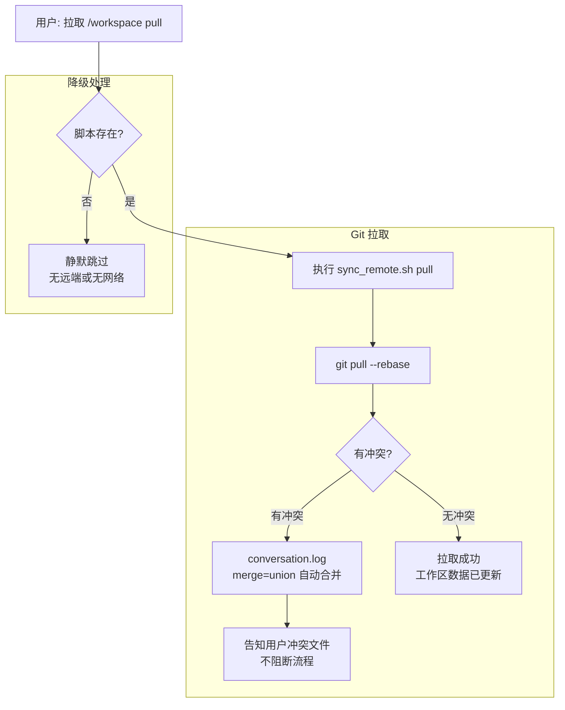

## 推送远端流程图

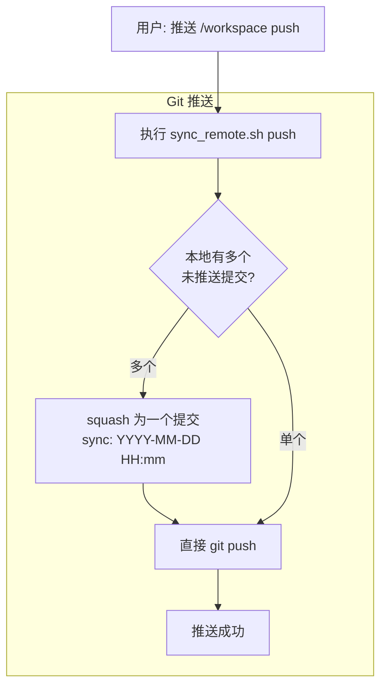

## 新阶段流程图

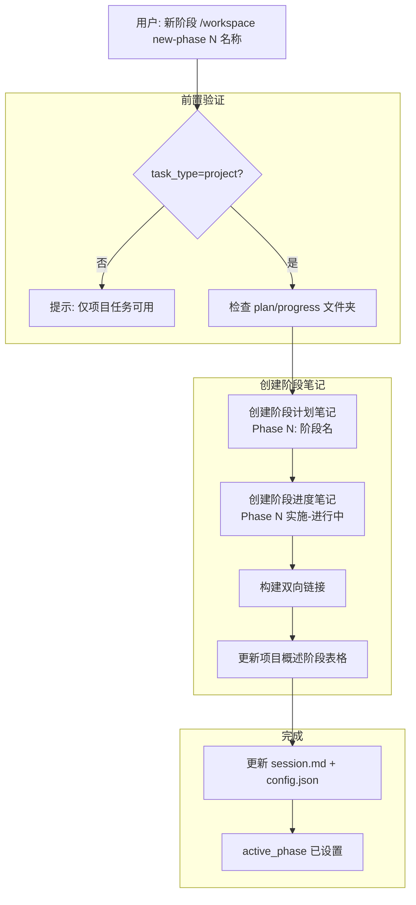

---

## 快速参考

| 流程 | 核心操作 | 输出 |
|------|----------|------|
| 开始工作 | 询问任务类型+创建笔记+Cron | status: active |
| 继续工作 | 检查日期+恢复上下文 | 显示状态 |
| 保存工作 | 更新时间戳+笔记内容 | 记录日志 |
| 结束工作 | 清理Cron+归档（默认保留） | status: completed |
| 新任务 | 创建任务笔记+双向引用 | 任务ID |
| 新阶段 | 创建计划+进度笔记+表格更新 | active_phase 已设置 |
| 拉取 | sync_remote.sh pull → git pull --rebase | 工作区数据已同步 |
| 推送 | sync_remote.sh push → squash + push | 推送完成 |
| 项目任务 | 创建项目集合+概述+每日笔记 | project_note_id |